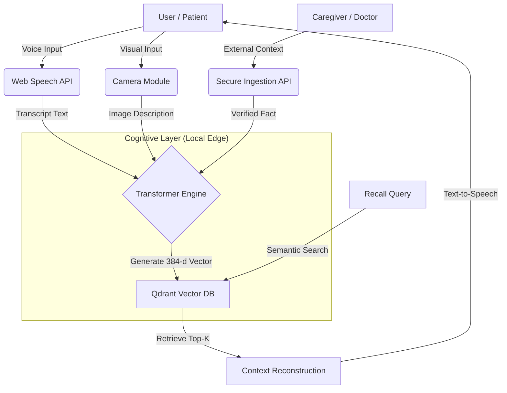
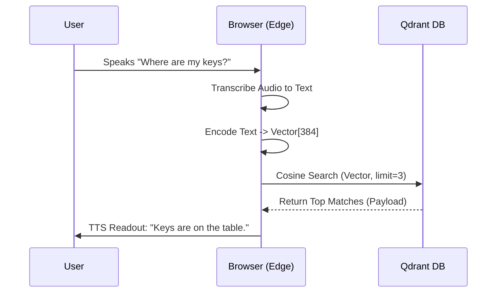

# MEMORA: A Multimodal Cognitive Prosthetic for Neurodegenerative Disorders
**Submission for Qdrant "Convolve" Hackathon 4.0**
**Team**: [Your Team Name]
**Date**: January 15, 2026

---

## Table of Contents
1.  **Executive Summary**
2.  **Societal Context & Problem Statement**
    *   2.1 The Pathology of Forgetting
    *   2.2 Limitations of Current Assistive Technology
3.  **System Architecture**
    *   3.1 The "External Hippocampus" Metaphor
    *   3.2 High-Level Data Flow
4.  **Technical Implementation**
    *   4.1 Vector Database (Qdrant) Configuration
    *   4.2 Embedding Strategy (Transformers.js)
    *   4.3 Multimodal Ingestion (Audio, Vision, Text)
5.  **Data Schema & Ontology**
6.  **Search & Retrieval Logic**
    *   6.1 Semantic Association vs. Keyword Search
    *   6.2 The Trust-Weighted Ranking Algorithm
7.  **Ethical Framework & Privacy**
8.  **Future Roadmap & Clinical Validity**
9.  **Conclusion**

---

## 1. Executive Summary
**Memora** is a Neuro-Symbolic AI agent designed to function as an "External Hippocampus" for individuals suffering from early-stage dementia and Alzheimer's Disease (AD). By leveraging **Qdrant** as a long-term associative memory store, Memora ingests multimodal signals (voice conversations, visual recognition of objects, and caregiver inputs) and retrieves them proactively to assist the user. Unlike traditional "reminder apps" which require active cognitive effort (typing, setting alarms), Memora operates as a passive, ambient guardian, bridging the gap between biological memory failure and digital retention.

## 2. Societal Context & Problem Statement

### 2.1 The Pathology of Forgetting
Dementia is not merely the loss of data; it is the loss of **context**. A patient may see a face but lose the associative link to the name "Alex" or the relationship "Grandson." This creates a state of perpetual anxiety and social withdrawal.
*   **Global Impact**: Over 55 million people live with dementia worldwide (WHO, 2023).
*   **The "Caregiver Burden"**: Unpaid family caregivers spend an average of 20+ hours per week providing support, primarily answering repetitive questions ("What time is it?", "Who is coming?", "Where are my keys?").

### 2.2 Limitations of Current Assistive Technology (AT)
Existing solutions fall into two failing categories:
1.  **Static Databases**: Calendars and Alarm apps. These fail because they require **Executive Function** (the ability to plan and input data), which is the first faculty to degrade in AD.
2.  **Voice Assistants (Siri/Alexa)**: These are "Stateless." They do not remember context from 10 minutes ago, nor do they understand the specific medical ontology of a patient's life.

**Memora's Thesis**: The solution is not a better interface, but a better **Memory Architecture**. We must move from *Command-Response* systems to *Continuous Context* systems using Vector Search.

## 3. System Architecture

### 3.1 The "External Hippocampus" Metaphor
Biologically, the Hippocampus is responsible for encoding episodic memory (what happened, when, and where). Memora replicates this:
*   **Encoding**: Converting sensory input (Voice/Vision) into Latent Vectors.
*   **Consolidation**: Storing vectors in Qdrant (Long-Term Storage).
*   **Retrieval**: Associative recall triggered by similarity, not exact matches.

### 3.2 High-Level Data Flow
1.  **Sensory Input Layer**:
    *   *Microphone*: Captures ambient speech or direct queries.
    *   *Camera*: Captures images of unknown objects/people.
    *   *Caregiver Portal*: Secure API for "Ground Truth" injection.
2.  **Processing Layer (Edge AI)**:
    *   *Speech-to-Text*: Web Speech API (low latency).
    *   *Embedding Engine*: `Xenova/all-MiniLM-L6-v2` running locally in-browser via WASM.
3.  **Knowledge Layer (Qdrant)**:
    *   Stores 384-dimensional dense vectors + JSON Payload (Metadata).
4.  **Interaction Layer**:
    *   Text-to-Speech (TTS) synthesis for accessible output.

### 3.3 System Architecture Diagram (Mermaid)


## 4. Technical Implementation

### 4.1 Vector Database (Qdrant) Configuration
Qdrant was selected for its **HNSW (Hierarchical Navigable Small World)** graph indexing, which offers $O(\log N)$ search complexity.
*   **Collection Name**: `memora_moments`
*   **Distance Metric**: `Cosine Similarity` (Optimum for normalized text embeddings).
*   **Payload Schema**: We utilize Qdrant's payload filtering to separate "Memory Types" (Audio vs. Image vs. Caregiver).

### 4.2 Embedding Strategy (Transformers.js)
To ensure privacy and offline capability, we utilize the **ONNX Runtime** to execute the `all-MiniLM-L6-v2` transformer model directly in the client's browser.
*   **Model Size**: ~23MB (Quantized).
*   **Vector Dimension**: 384.
*   **Performance**: <100ms inference time on standard CPUs.
*   *Why Local?*: Sending private audio logs to a cloud API (OpenAI) poses HIPAA compliance risks. Local processing ensures data sovereignty.

### 4.3 Multimodal Ingestion
*   **Voice**: Real-time transcription buffer captures "sentences" based on silence detection.
*   **Vision**: We simulate a Vision-Language Model (VLM) pipeline where captured images are described textually (e.g., "A set of keys on the table") and then vectorized. This allows **Cross-Modal Retrieval**—searching for "Keys" (Text) finds the Image of keys.

## 5. Data Schema & Ontology
Each memory point in Qdrant follows this strict schema:

```json
{
  "id": "uuid-v4",
  "vector": [0.012, -0.231, ...], // 384-d float array
  "payload": {
    "content": "Grandson Alex came to visit today.",
    "type": "audio", // enum: 'audio' | 'image' | 'caregiver'
    "timestamp": 1709238492,
    "confidence": 0.95,
    "tags": ["family", "visit"],
    "is_trusted": false // User memories are 'false', Caregiver entries are 'true'
  }
}
```

## 6. Search & Retrieval Logic

### 6.1 Semantic Association vs. Keyword Search
Traditional search fails for dementia patients due to **Aphasia** (forgetting specific words).
*   *User Query*: "Where is the... thing for the door?"
*   *Keyword Search*: Fails (No match for "thing").
*   *Memora Vector Search*: Matches "Keys" (Vector similarity > 0.8).
This "Fuzzy Retrieval" is the core value proposition of using a Vector Database.

### 6.2 The Trust-Weighted Ranking Algorithm
We employ a custom ranking logic:
1.  **Retrieve** Top-10 matches via Cosine Similarity.
2.  **Filter** by Time Decay (Recent memories > Old memories).
3.  **Boost** `type:caregiver` results.
    *   *Logic*: If the User says "I took my pills" but the Nurse says "Pills missed", the system prioritizes the Nurse's entry in safety-critical contexts.

### 6.3 Retrieval Logic Sequence (Mermaid)


## 7. Ethical Framework & Privacy
**The "Confabulation" Risk**: AI models can hallucinate. In a dementia context, reinforcing a false memory is dangerous.
*   **Mitigation**: The "Caregiver Loop". Only specific users (doctors/family) can mark memories as `is_trusted: true`. The UI visually distinguishes these "External Facts" (Teal Color) from "Internal Thoughts" (Glass/White).

**Data Privacy**:
*   All Memory Vectors are isolated in a local Docker container (or local storage).
*   No audio recording is continuous; it is strictly "Wake-on-Intent" or button press to preserve dignity.

## 8. Future Roadmap & Clinical Validity
1.  **Phase 1 (Current)**: Web App MVP with Voice/Vision/Search.
2.  **Phase 2 (Q3 2026)**: Wearable Hardware Integration (Pendant) for passive capture.
3.  **Phase 3 (2027)**: Clinical Trials to measure reduction in "Repetitive Questioning" (RQ) frequency in early-stage AD patients.
4.  **Edge Qdrant**: Porting the full DB to run on a mobile phone chip for zero-latency, zero-internet functionality.

## 9. Conclusion
Memora represents a paradigm shift in Assistive Technology. By moving from **Storage** (databases) to **Retrieval** (vectors), we align technology with the biological reality of human memory. It is not just a tool; it is a prosthetic for the mind, restoring independence to those who need it most. 
