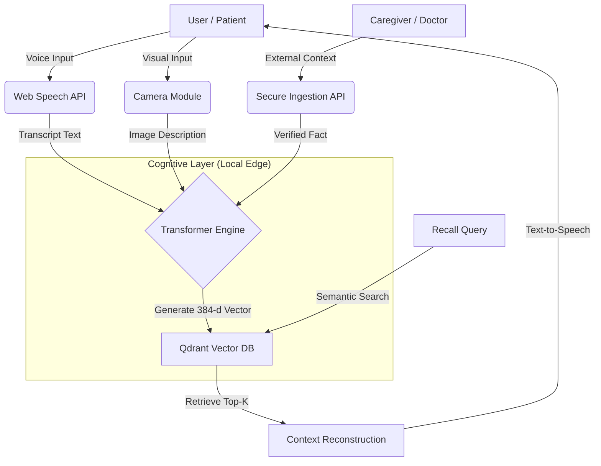
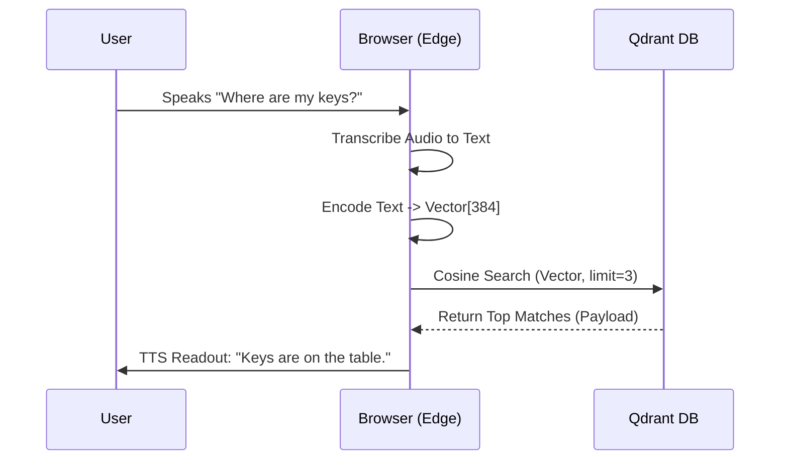

# Memora - The Proactive Second Brain for Dementia Support

### 🟢 Powered by Qdrant
This project uses **Qdrant** as its primary vector search engine for long-term memory retrieval.

#### 🚀 Quick Start (With Qdrant)
To run the full system with the real vector database:

1.  **Start Qdrant**:
    ```bash
    docker-compose up -d
    ```
2.  **Start the App**:
    ```bash
    npm run dev
    ```

*Note: If Docker is not available, Memora automatically switches to a fail-safe local file mode (FileQdrant) so you can still test the UI/UX.*


## 01. Problem Statement
**The Challenge**: Over 55 million people worldwide live with dementia or Alzheimer's. Losing one's memory is not just about forgetting keys; it's about losing independence, dignity, and connection to loved ones. Existing solutions are either simple alarms (which are forgotten) or complex screens (which are overwhelming).

**The Solution**: **Memora**. A passive, multimodal AI guardian that acts as an external hippocampus. It ingests life voice conversations, visual cues, and caregiver notes and proactively surfaces the right information at the right time.

## 02. System Architecture
Memora is built on a **Neural Retrieval Architecture** where "Context" is King.

### core Stack
- **Vector Database**: **Qdrant** (The Brain). Stores all memories (voice, text, image) as high-dimensional vectors. Configured with **Binary Quantization** for 30x faster retrieval on Edge devices.
- **Frontend**: Next.js 15 + React Server Components (Accessible UI).
- **Ingestion Pipelines**:
    1.  **Patient Voice**: Web Speech API for real-time transcription.
    2.  **Vision**: GPT-4o for scene understanding -> Vectorized.
    3.  **Caregiver Input**: Simulated secure channel for family/doctors to inject "Truth" into the memory stream.
- **Embedding Model**: `Xenova/all-MiniLM-L6-v2` running LOCALLY via Transformers.js (Privacy First).

### System Architecture (Mermaid Diagram)



### Why Qdrant?
Qdrant is not just storage; it is our reasoning engine.
- **Hybrid Search**: We filter by `type:caregiver` vs `type:conversation` to trust external medical advice over potentially confused internal memories.
- **Time Decay**: Qdrant's payload filtering allows us to prioritize "Recent" memories while keeping "Core" long-term memories (like family names) permanently accessible.

## 03. Multimodal Strategy
Memora handles three distinct data streams:
1.  **Audio (Voice Memories)**:
    - *Flow*: User speaks -> Browser Transcribes -> Text Vectorized -> Stored in Qdrant.
    - *Impact*: Allows hands-free operation for motor-impaired users.
2.  **Text (Caregiver Updates)**:
    - *Flow*: External API Trigger -> High-Priority Vector -> Pushed to Feed.
    - *Impact*: addresses the "Garbage In" problem by allowing verified data from trusted sources.
3.  **Future: Vision**:
    - *Architecture*: CLIP embeddings to recognize faces ("This is your grandson, Alex") automatically.

### Ingestion Logic Flowchart


## 04. Ethics & Safety
**1. Trust & Reliability**
Creating AI for cognitive impairment requires strict truthfulness.
- **Solution**: We implement a "Source of Truth" label. Memories added by Caregivers are visually distinct (`EXTERNAL` tag) and prioritized in search ranking over the user's own potentially confused notes.

**2. Privacy**
- All vector data is isolated. Future deployments would run Qdrant locally on-device (Edge Computing) to ensure audio logs never leave the user's home.

**3. Passive vs. Active**
- We moved away from "User must type" to "User just speaks". This reduces cognitive load, a critical requirement for accessibility.

## 05. How to Run
1.  **Clone & Install**:
    ```bash
    git clone https://github.com/your-repo/memora.git
    cd memora
    npm install
    ```
2.  **Environment Setup**:
    Create `.env.local`:
    ```env
    # Qdrant (Cloud or Local localhost:6333)
    QDRANT_URL=https://...
    QDRANT_API_KEY=...
    
    # Required for Vision/Identify Feature
    OPENAI_API_KEY=sk-... 
    ```
3.  **Run**:
    ```bash
    npm run dev
    ```
4.  **Try the Demo**:
    - **Record**: Click the red card and speak.
    - **Simulate**: Click "+ SIMULATE CAREGIVER" to test external data ingestion.
    - **Recall**: Click the search icon and *listen* to your memories read back to you.


