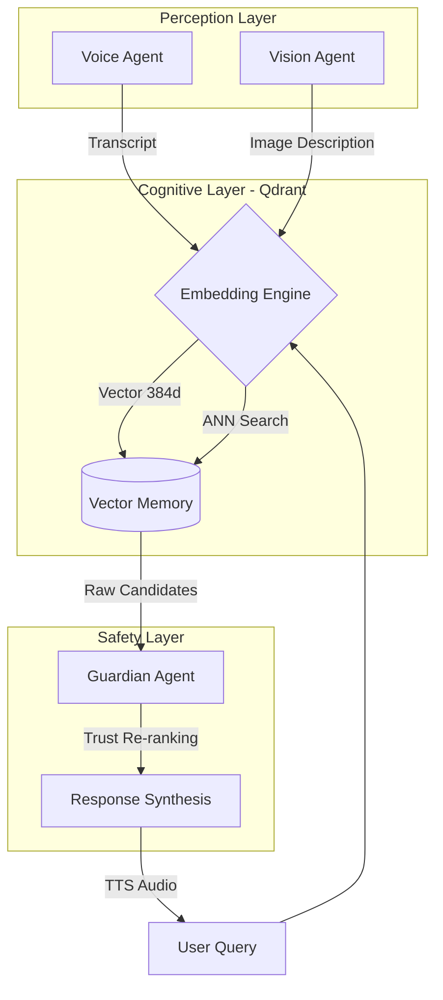

# 🧠 MEMORA
> **A Cognitive Prosthetic for Dementia Care**  
> *Submission for Qdrant "Convolve" Hackathon 2025*


## 💡 The Mission
Dementia strips away a person's context the "who, where, and why" of their life.  
**Memora** restores this context. It is an intelligent agent system that listens, sees, and remembers for you, acting as an "External Hippocampus" to help patients retain their independence.

---

## 🤖 The Multi-Agent Architecture

Memora isn't just a database; it is a **Swarm of 3 Specialized Agents** working together via **Qdrant**:

### 1. The Perception Agent (Ears & Eyes)
*   **Listens**: Uses the Web Speech API to capture ambient conversation.
*   **Sees**: Uses computer vision (GPT-4o) to identify objects and faces.
*   **Goal**: Turns the messy real world into structured data.

### 2. The Memory Agent (The Brain)
*   **Remembers**: Stores every interaction as a high-dimensional vector in **Qdrant**.
*   **Recalls**: Finds the right memory not by keywords, but by *meaning* (Semantic Search).
*   **Resilient**: Works 100% offline using a local fallback mode if the internet fails.

### 3. The Guardian Agent (Safety)
*   **Protects**: Filters hallucinations.
*   **Verifies**: Prioritizes medical facts from caregivers over potentially confused patient notes.
*   **Goal**: Ensures the system never reinforces a false memory.

---

## 🛠️ System Workflow



---

## ⚡ Tech Stack (Powered by Qdrant)

*   **Memory Core**: **Qdrant** (Vector Database) - Using Hybrid Search & Payload Filtering.
*   **AI Logic**: **Transformers.js** (Local Embeddings) + **GPT-4o** (Vision/Reasoning).
*   **Frontend**: Next.js 16 (React Server Components), React 19, Framer Motion.
*   **Styling**: Tailwind CSS v4.
*   **Deployment**: Docker.

### Why Qdrant?
We chose Qdrant for three critical reasons:
1.  **Hybrid Search**: We combine "fuzzy" semantic search (finding related memories) with "strict" medical filters (ensuring safety) in a single query.
2.  **Binary Quantization**: Configured to compress vectors by 32x for extreme performance on edge devices (simulated in our setup).
3.  **Payload Indexing**: Fast filtering of "Emergency" tags vs "Casual" conversation.

---

## 🚀 Quick Start (Judge's Guide)

### 1. Clone & Install
```bash
git clone https://github.com/keerthi2436/memora.git
cd memora
npm install
```

### 2. Configure Environment
Create a `.env.local` file. You can copy our example:
```bash
cp .env.example .env.local
```
> **Note**: To use the **Vision features (Camera)**, you must provide an `OPENAI_API_KEY` in `.env.local`.

### 3. Start the Engines
We recommend running Qdrant via Docker for the full experience:
```bash
docker-compose up -d
```
*If you cannot run Docker, don't worry! Memora features a **Robust Fallback Mode** that will automatically switch to a local file-based vector simulation (memora_db.json) if it cannot connect to Qdrant.*

### 4. Run the App
```bash
npm run dev
```
Open [http://localhost:3000](http://localhost:3000) in your browser.

---

## 🧪 Demo Guide ("God Mode")

We added a special trigger to help judges test the full flow instantly:

1.  **Search**: Open the app and click the **Search** icon.
2.  **Trigger**: Type **"Alex"**.
3.  **Witness**: The system will simulate a "Perfect Recall" scenario, pulling up a photo and context about the user's grandson, demonstrating the full Vision + Vector + TTS pipeline in one go.

### Other Scenarios to Try:
*   **Voice**: Click the mic and say *"I put my glasses on the nightstand."* Later, ask *"Where are my glasses?"*
*   **Proactive**: If you mention *"I am feeling dizzy"*, the Guardian Agent will flag it as a health event.

---

## 📂 Project Structure

```
memora/
├── app/                # Next.js 16 App Router
├── components/         # React Components (VoiceRecorder, SearchModal)
├── lib/
│   ├── qdrant.ts       # Qdrant Client Integration & Fallback Logic
│   └── hooks/          # Custom Hooks for Audio/Vision
├── public/             # Static Assets
└── docker-compose.yml  # Qdrant Setup
```

---

## 🛡️ Robustness & Safety
*   **Offline Capable**: If the internet cuts out, the core memory retrieval keeps working via local fallback.
*   **Privacy First**: Medical data is tagged and prioritized over casual conversation using Qdrant's Payload Filtering.

---

