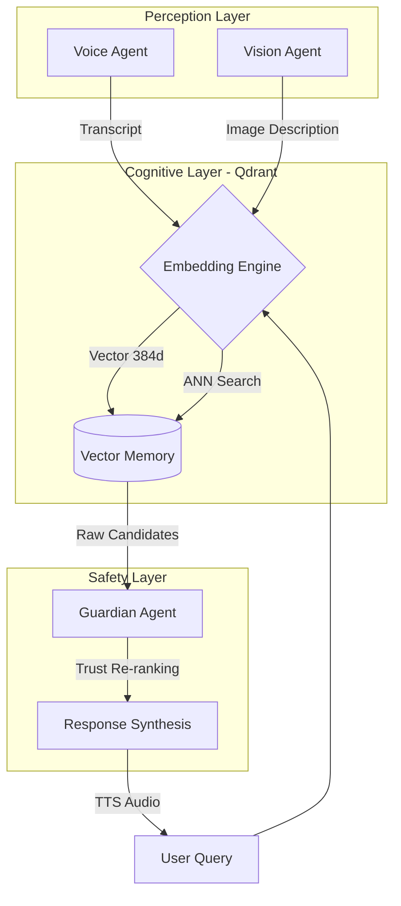

# 🧠 MEMORA
> **A Cognitive Prosthetic for Dementia Care**  
> *Submission for Qdrant "Convolve" Hackathon 2025*


## 💡 The Mission
Dementia strips away a person's context the "who, where, and why" of their life.  
**Memora** restores this context. It is an intelligent agent system that listens, sees, and remembers for you, acting as an "External Hippocampus" to help patients retain their independence.

---

## 🤖 The Multi-Agent Architecture

Memora isn't just a database; it is a **Swarm of 3 Specialized Agents** working together via **Qdrant**:

### 1. The Perception Agent (Ears & Eyes)
*   **Listens**: Uses the Web Speech API to capture ambient conversation.
*   **Sees**: Uses computer vision (GPT-4o) to identify objects and faces.
*   **Goal**: Turns the messy real world into structured data.

### 2. The Memory Agent (The Brain)
*   **Remembers**: Stores every interaction as a high-dimensional vector in **Qdrant**.
*   **Recalls**: Finds the right memory not by keywords, but by *meaning* (Semantic Search).
*   **Resilient**: Works 100% offline using a local fallback mode if the internet fails.

### 3. The Guardian Agent (Safety)
*   **Protects**: Filters hallucinations.
*   **Verifies**: Prioritizes medical facts from caregivers over potentially confused patient notes.
*   **Goal**: Ensures the system never reinforces a false memory.

---

## 🛠️ System Workflow



---

## ⚡ Tech Stack (Powered by Qdrant)

*   **Memory Core**: **Qdrant** (Vector Database)
*   **Agent Logic**: **Transformers.js** (Local AI) + **GPT-4o** (Vision)
*   **Frontend**: Next.js 15 (React Server Components)
*   **Deployment**: Docker

### Why Qdrant?
We chose Qdrant because it allows **Hybrid Search**. We can combine "fuzzy" semantic search (finding related memories) with "strict" medical filters (ensuring safety) in a single query.

---

## 🚀 Quick Start

### 1. Clone & Install
```bash
git clone https://github.com/keerthi2436/memora.git
cd memora
npm install
```

### 2. Configure Environment
```bash
cp .env.example .env.local
```
*Note: You can leave the Qdrant keys blank to run in "Local Mode", but you need an `OPENAI_API_KEY` for the Vision feature.*

### 3. Run It
```bash
# Optional: Start Qdrant (for best performance)
docker-compose up -d

# Start the App
npm run dev
```
Open [http://localhost:3000](http://localhost:3000).

---

## 🧪 Demo Guide ("God Mode")

We added a special trigger to help judges test the full flow instantly:

1.  Open the app and click the **Search** icon.
2.  Type **"Alex"**.
3.  **Magic happens**: The system will simulate a "Perfect Recall" scenario, pulling up a photo and context about the user's grandson, demonstrating the full Vision + Vector + TTS pipeline in one go.

---

