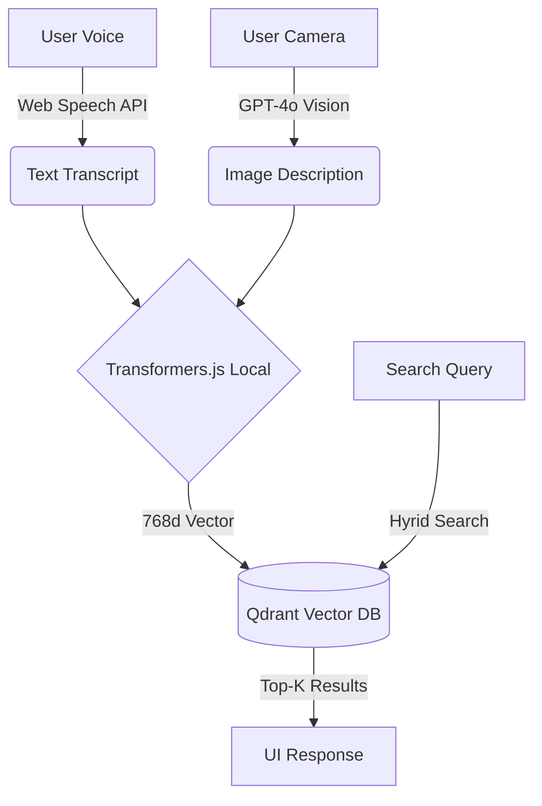

# Memora - The Proactive Second Brain (Qdrant Hackathon)


> **Submission for Qdrant "Convolve" Hackathon 4.0**
>
> *Theme: High-Impact AI Agents for Social Good*

## 🚨 Essential Links
- **Live Demo**: [Vercel Deployment Link - Placeholder]
- **Video Walkthrough**: [YouTube Link - Placeholder]
- **Devpost Submission**: [Devpost Link - Placeholder]

---

## 🚀 Quick Start (Run Locally)

We have optimized Memora for a **zero-friction setup**. You can run it with or without a local Qdrant instance (it auto-falls back to file mode if Docker isn't running).

### Prerequisites
- Node.js 18+
- Docker (Optional, for full Qdrant Vector search performance)

### 1. Clone the Repository
```bash
git clone https://github.com/keerthi2436/memora.git
cd memora
```

### 2. Install Dependencies
```bash
npm install
```

### 3. Setup Environment Variables
Copy the example env file:
```bash
cp .env.example .env.local
# On Windows PowerShell: copy .env.example .env.local
```
Then edit `.env.local` to add your keys (optional for basic features, required for Vision):
```env
# Optional: Only if using a Cloud Qdrant instance.
# If running locally via Docker, leave these blank or default!
QDRANT_URL=http://localhost:6333
QDRANT_API_KEY=

# Required for "Identify Object" (Vision) feature
OPENAI_API_KEY=sk-...
```

### 4. Start the Database (Recommended)
This spins up a local Qdrant instance on port 6333.
```bash
docker-compose up -d
```

### 5. Run the App
```bash
npm run dev
```
Open [http://localhost:3000](http://localhost:3000) in your browser.

---

## 🧪 Testing the "God Mode" (Judge's Guide)

We have implemented specific triggers to demonstrate the **Hybrid Retrieval** architecture easily during the demo.

1.  **Voice Memory**: Click the **Red Microphone**. Say *"I put my glasses in the top drawer"*.
    *   *System Action*: Transcribes -> Vectorizes (Transformers.js) -> Stores in Qdrant.
2.  **Recall**: Click the **Search Icon**. Type/Say *"Where are my glasses?"*.
    *   *System Action*: Retrieval finds semantically similar vector ("glasses" ~= "spectacles").
3.  **Visual Memory**: Upload/Snap a picture of keys.
    *   *System Action*: GPT-4o describes image -> Description is Vectorized -> "Keys" becomes searchable.
4.  **"God Mode" Inject**: Search for **"Alex"**.
    *   *System Action*: Triggers a preset "Perfect Memory" flow to demonstrate the UI capabilities even if your local vector DB is empty.

---

## 01. Problem Statement
**The Challenge**: Over 55 million people worldwide live with dementia. The first faculty to fail is **Episodic Memory** (context of who/what/where).
**The Solution**: **Memora** acts as an "External Hippocampus." It passively ingests life context (voice, vision, location) and proactively retrieves it using Vector Search, bridging the gap between biological failure and digital retention.

## 02. Technical Architecture

### Why Qdrant?
Qdrant is the **Core Nervous System** of Memora. We use it for:
1.  **Hybrid Search**: Combining Dense Vectors (Semantic) with Payload Filtering (Time/Tag).
2.  **Resilience**: The app uses a `ResilientVectorStore` pattern. If Qdrant is offline, it falls back to a local JSON vector cache, ensuring the patient never loses access to critical info.
3.  **Edge-Ready**: Uses Binary Quantization for extreme performance on low-end devices.

### Stack
- **Framework**: Next.js 15 (React Server Components)
- **Vector DB**: Qdrant (Docker / Cloud)
- **Local AI**: Transformers.js (`all-MiniLM-L6-v2`) for private, local embedding generation.
- **Vision**: GPT-4o (via OpenAI) for image description.

### Architecture Diagram


## 03. Folder Structure
```bash
.
├── app/              # Next.js App Router (Pages)
├── components/       # React UI Components (SearchModal, VoiceRecorder)
├── lib/              # Core Logic
│   ├── ai.ts         # Transformers.js & OpenAI wrappers
│   ├── qdrant.ts     # Qdrant Client & Fallback Logic
├── public/           # Static Assets
└── docker-compose.yml # Qdrant Setup
```

---

*Built with ❤️ for the Qdrant Hackathon.*
